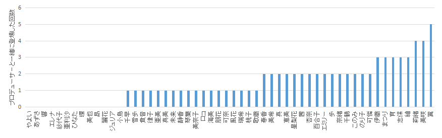
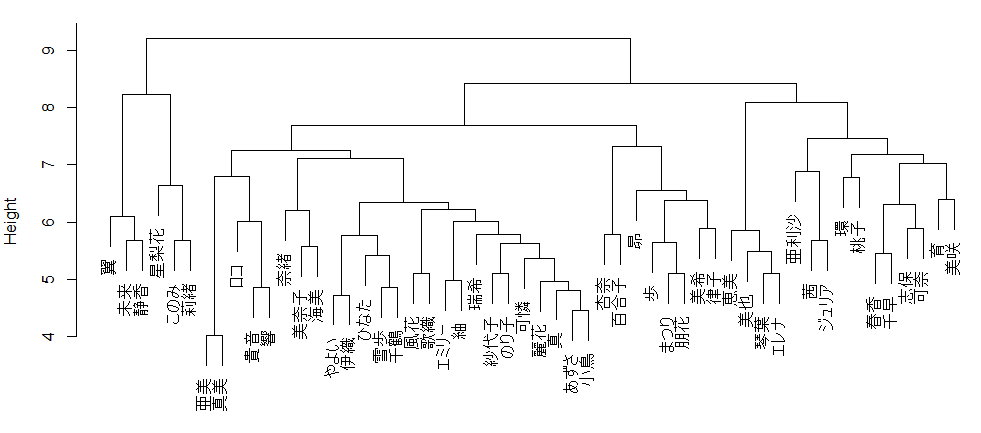
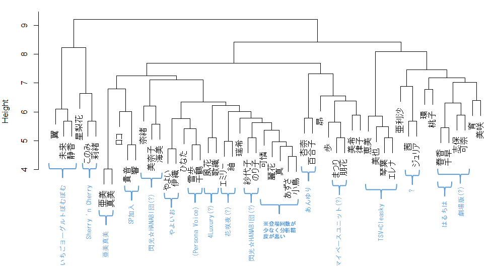
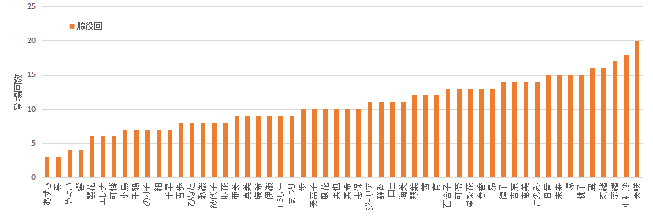
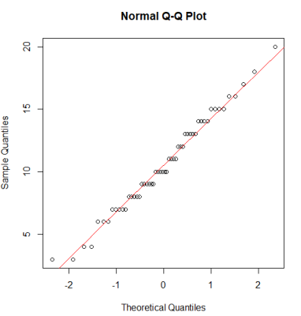
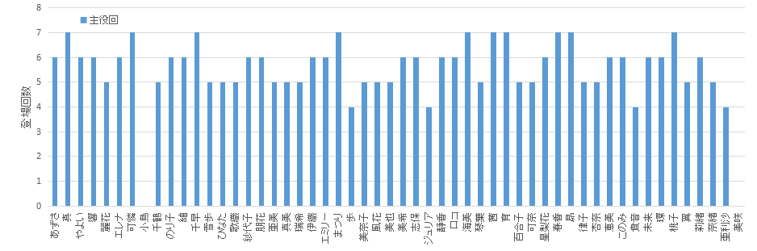

# **ミリシタ4コマ漫画を分析する**

この記事は[アイドルマスター Advent Calendar 2020](https://adventar.org/calendars/4976)の10日目の記事になる予定です。

# まとめ
* じゅりあかに注目！
* プロデューサーにもアイドルにもガシャは公平
* 4コマはいいぞ

# 始めに
アイドルマスター ミリオンライブ! シアターデイズ(以下ミリシタ)はアプリ内のコミックメニューには"Blooming Clover", "Brand New Song", "4コマ"の3つの漫画作品が掲示されています。漫画を含むアイドルマスターの作品群は一般的にパラレルワールドであるとされており[1]、これらの漫画作品もミリシタとは別時空にあるパラレルワールドであると考えられます。しかしこのうち「4コマ」漫画に関しては、アプリ内で直接閲覧することができ、「4コマ」に関してはミリシタと同じ世界に属していると考えてよいのではないかと思われます。

そこで、ミリシタの世界を理解する一助として、4コマのデータを分析を試みました。今回は4コマに登場するアイドルをカウントして定量的な評価をおこない、定性的な評価(話の内容など)は行いませんでした。

分析にあたっては以下の内容を前提としました。
* 2020/11/19Twitter掲載分までの内容を集計
* 4コマ内で名前が記載されている(アプリ版では下部にリストアップされている)アイドルを集計した。4コマに登場しても名前が掲載されていないアイドルは対象外とした。

ちなみに私は律子さん担当です。

※注意：データ分析や統計処理をしてますが、調べながらやっている素人です。間違っている可能性が高いです。誤りに気づいた方はぜひご指摘ください。

# 4コマ基礎知識
4コマを読んでいる人ならみんな知っている知識の再確認です。
* 4コマはガシャに登場したSSRアイドルおよびミリオンクローゼットSRアイドルを主役にした漫画である。
* Twitterでは「＊＊ちゃんです」と紹介されたアイドル、アプリでは登場人物一覧の左上に表示されたアイドルが主役である。
* 作画はmizuki, [ima](https://twitter.com/ima8765), [せるげい](https://twitter.com/pattundo), [たはらえむ](https://twitter.com/mowahu), [木漏](https://twitter.com/komore), [ひーりんぐ](https://twitter.com/healstar), [凪庵](https://twitter.com/nagian)の7名が担当している。作画者は書籍版で確認が可能。
* 2017年12月から開始された。ミリシタ実装日(2017年6月)にはまだなかったので、初期のSSRアイドルを主役にした4コマは存在しない。
* エイプリルフール回(これまで2回実施)はガシャの内容と関係なく制作されており、主役は設定されていない。
* 2周年イベントで公開された2話(Jelly Pop Beans/幕間MC, トゥインクルリズム/誤解です！)は[書籍版2](https://www.amazon.co.jp/gp/product/B08DX9N323)にのみ掲載されている。(なおこの2話は今回の解析には含めない)
* アプリの[コミュ]-[エトセトラ]からは、主役回を閲覧できる。
* 「[今日も風紀は正常です！](https://twitter.com/imasml_theater/status/1153606042732773376)」はTwitterに掲載されているが、アプリには掲載されていない。書籍版には掲載。
* 書籍版は改変されている箇所がある。第一話「[ジュリアの確信](https://twitter.com/imasml_theater/status/945947882296713217?s=20)」ではあずささんが登場するが、アプリ版とTwitter版では名前が掲載されていない。書籍版では名前が掲載されている。

# 4コマ基礎データ
手作業で登場アイドルをまとめました。2020/11/19Twitter掲載分までのデータは以下のとおりです。集計したデータは[Google sheetsで公開](https://docs.google.com/spreadsheets/d/14KC8lHOe0S-ue4UAJ7uWfjGmhmcPYsxALOX3myee_rU/)しています。
* 話数：296話
* のべ登場人数：865人
* 平均登場人数：2.9人
* 最多登場アイドル：桃子、奈緒、莉緒、亜利沙(計22回)
* 最少登場アイドル：あずささん(計9回)、(参考：小鳥さん：計7回)
* 最多登場人数(名前が表示されているアイドルの数)：8名(「[そんなこと決められません…！](https://twitter.com/imasml_theater/status/1154707937597673474?s=20)」)
* 社長は2回、早坂さんは1回、プロデューサーは35回登場している。ただしこれらの登場人物は今回の解析に含めない。

* 登場回数の集計グラフは以下のとおり(「主役回」は主役として登場した回数、「脇役回」は主役以外で登場した回数)

* ちなみにプロデューサーと一緒に登場した回数が最も多いのは翼で5回


# 公式だけど公式じゃない、新たなユニットの可能性を見出す
## 背景
前述のとおり、4コマは1話平均2.9人が登場しています。登場するアイドルの組み合わせは様々であり、多様で魅力的なやり取りが繰り広げられています。中には特定の組み合わせをよく見かけるような気もします。

アイドルが同じ回に登場するということは、そのアイドルは行動をともにしていたということであり、一緒にいることが多いということです。すなわち、同じ話に登場したアイドルは、仲が良いと言えるのではないでしょうか？

そこで、どのアイドル同士の組み合わせが多いのか、階層型クラスター分析で調べてみました。同じクラスターに入ったアイドルは仲がよいはずであり、新たなユニットの可能性が見える可能性が期待できます。

階層型クラスター分析とは何なのか、結果のグラフを見たらなんとなくわかるかと思いますが、詳細は省きます。近い関係にいる人同士をグループ化する技術です。私はこのサイト[2]で勉強しました。

## 方法
分析には統計分析フリーソフト"R"および統合開発環境"[R Studio](https://rstudio.com/)"を用いました。


各話に登場したアイドルを1、登場していないアイドルを0として、次のようなCSVファイルを作成しました。


R Studioに次のスクリプトを入力し、階層型クラスター分析を行いました。
```R
million<-read.table("million4koma.csv", header=T, sep=",", row.names=1)
million.d<- dist(million)
million.hc<-hclust(million.d,method="ward.D")
plot(million.hc)
```


## 結果

解析結果を次図に示します。つながっている部分が下にあるほど強固なつながりがあります。


比較的強いつながりがある組み合わせに名前を付けたものが次の図です。



ほとんどがよく見る組み合わせですね。妥当といえば妥当な結果になりました。

個人的にちょっと面白い組み合わせができたかなと思うのは"ジュリア×茜"ですね。この組み合わせは計4話に登場しています。
https://twitter.com/imasml_theater/status/999215860509233152
https://twitter.com/imasml_theater/status/1068429678313201665
https://twitter.com/imasml_theater/status/1259770722441986048
https://twitter.com/imasml_theater/status/1273220122585346054

茜のボケとジュリアのツッコミがうまくかみ合って、夫婦漫才のような雰囲気を醸し出しています。この半歩引いて周囲を客観視できるアイドル同士が相手の内面を互いにさらけ出しあうスパイラルに突入して際限なくなる様がいいですね。

他には"千鶴×雪歩"や"風花×歌織"あたりが明確な名前がまだない(?)ユニットですが、"千鶴×雪歩"はユニット名はないもののPersona Voiceで共演済みですし、"風花×歌織"は4Luxuryの半身ですね。

ちなみに律子さんは美希と緩やかなつながりがあるようです。"みきりつ"も人気のある組み合わせであり妥当な分析結果だと言えますね。

## 結論
"ジュリア×茜"に今後注目！


# ミリシタに潜む差別を糾弾せよ！
## 背景
上に出した登場回数グラフを再掲します。


亜利沙と小鳥さんの登場回数は3倍以上違います。あずささんとの比較でも2倍以上違います。なぜこんなに差があるのでしょうか？

登場回数の内訳を見ると、「主役」として登場する回数はどのアイドルもあまり変わりません。主役回はSSRカードの登場で決まるものであり、SSR枚数は平等なので主役回数も平等です。

「脇役」(ここでは「主役ではない」というだけの意味であり、ネガティブな意図はありません)としての登場回数に差があるということです。脇役登場回数をグラフ化してみましょう。



あずささんと真は登場回数が3回であるのに対し、美咲さんは20回です。約7倍の差があります。アイドルトップの亜利沙との比較でも6倍の差があります。

明らかに登場回数に差を付けられています！これは差別です！「ひとりも手放さない」[3]の精神はどこに行ったのでしょうか？

では差別が行われている実態を統計で明らかにしましょう。

## 方法および結果

もし「脇役回」への採用が公平に(ランダムに)行われているのだとすると、脇役回登場回数は正規分布になるはずです。そこで脇役回登場回数の正規性を調べることにします。[シャピロ–ウィルク検定](https://ja.wikipedia.org/wiki/%E3%82%B7%E3%83%A3%E3%83%94%E3%83%AD%E2%80%93%E3%82%A6%E3%82%A3%E3%83%AB%E3%82%AF%E6%A4%9C%E5%AE%9A)を使うと、サンプルの正規性を評価できます。有意水準5%で検定しましょう。

```R
wakiyaku<-read.table("4koma_count.csv", header=F, sep=",", row.names=1)
x=wakiyaku$V2
shapiro.test(x)
```

```
	Shapiro-Wilk normality test

data:  x
W = 0.98464, p-value = 0.7143
```
p値71% >> 有意水準5%です。正規分布でないとは到底言えなさそうです(正規分布であるとは言っていない)。

念のため正規性を評価するグラフも描きましょう。正規性見るために[Q-Qプロット](https://bellcurve.jp/statistics/glossary/2071.html)を描きます。
```R
qqnorm(x)
qqline(x, col=2)
```


プロットが赤い線の上に乗ったら正規分布になっています。ちゃんと乗っていますね。

*良かった！差別されているアイドルはいなかったんだね！*

まずはひと安心です。

ではなぜ7倍もの差が付いたのでしょうか？

あらためて計算してみましょう。

基礎データの章で、1話の平均登場人数は2.9人であることを紹介しました。脇役の登場人数は1.9人ということです。登場するアイドル＋事務員の人数は54名で、内一人は主役として登場するので、53人から1.9人が脇役に選ばれることになります。脇役に選ばれる確率は3.6%です。

これまで4コマは296話が掲載されています。3.6%の確率であたるくじを296回引いたときに何回あたるかという計算です。二項分布で計算します。


理論的には、4コマに脇役として登場する回数は10回の人が最も多くて6.7人であるという計算結果になりました。実際の4コマデータでは、登場回数10回の人は6人ですので大体あっています。登場回数が少ない領域や多い領域では理論値と差がありますがバラツキの範囲でしょうかね？(296回の試行で3回しか選ばれなかった人が2人もいますが、理論的には0.23人しかいないはずです。20回も選ばれた人が1人いますが、0.17人しかいないはずです。ちょっとこのあたりは恣意的なものを感じてしまいますが、正規性は確認できたので恣意性はないはずです。ないったらないの！)

ということで、ミリシタ4コマの登場回数は理論的にほぼ説明することができましたので、登場人物の選び方に差別がないことが再確認できました。

### 4コマとガシャ

……と、ここまで来て、偶然ではありますが気になる数字に遭遇しましたよね。3.6%と296回です。これ、天井ガシャSSRの数字ですね。SSR確率は3%、天井は300回。天井までガシャを引いたときにSSRを何枚入手できるのか。

3%と300回に微修正してグラフを描いてみましょう。ついでに累積確率も描きます。


天井300回まで引いたとき、上位10%の人はSSRを12枚以上入手できますが、下位10%の人のSSR入手枚数は5枚以下です。悲しいけどこれが確率なのよね。

### 平等と公平

話を戻して、4コマ登場回数についても意図的に差を付けられているわけではなく、確率の問題であると言えそうです。主役回数は平等で、脇役回数は公平です。「ひとりも手放さない」[3]やり方にも、平等なやり方と公平なやり方があるということです。

主役回：平等　

脇役回：公平 

プロデューサーは3%の確率に一喜一憂しますが、アイドル達には3.6%の確率に一喜一憂があるのかもしれません…

## 結論

美咲さんは豪運の持ち主

# References
[1] 坂上陽三、[【坂上です】ワンフォーオールの世界感](https://idolmaster.jp/blog/?p=3694)、2014

[2] 金明哲、[Rとクラスター分析（１）](https://www1.doshisha.ac.jp/~mjin/R/Chap_28/28.html)

[3] 藤本記子(作詞)、[UNION!!](https://www.youtube.com/watch?v=cxtxp2FXh-U), 2018

# Supplementary materials
* [集計データ](https://docs.google.com/spreadsheets/d/14KC8lHOe0S-ue4UAJ7uWfjGmhmcPYsxALOX3myee_rU/)

# 宣伝
ミリシタ、アイマス関係のツールや分析をいろいろやってますので、よろしければ見ていってください。

[tankarup.github.io](https://tankarup.github.io/tsunagaru/tsunagaru.html)


