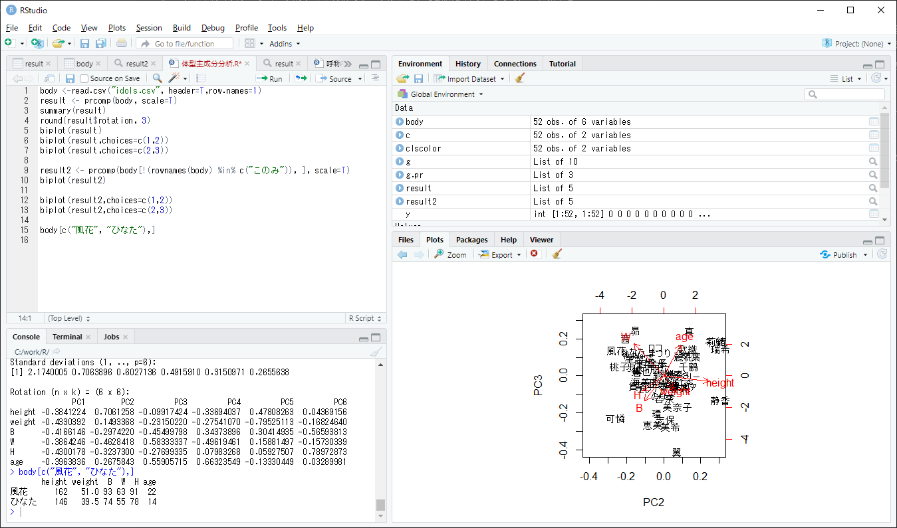
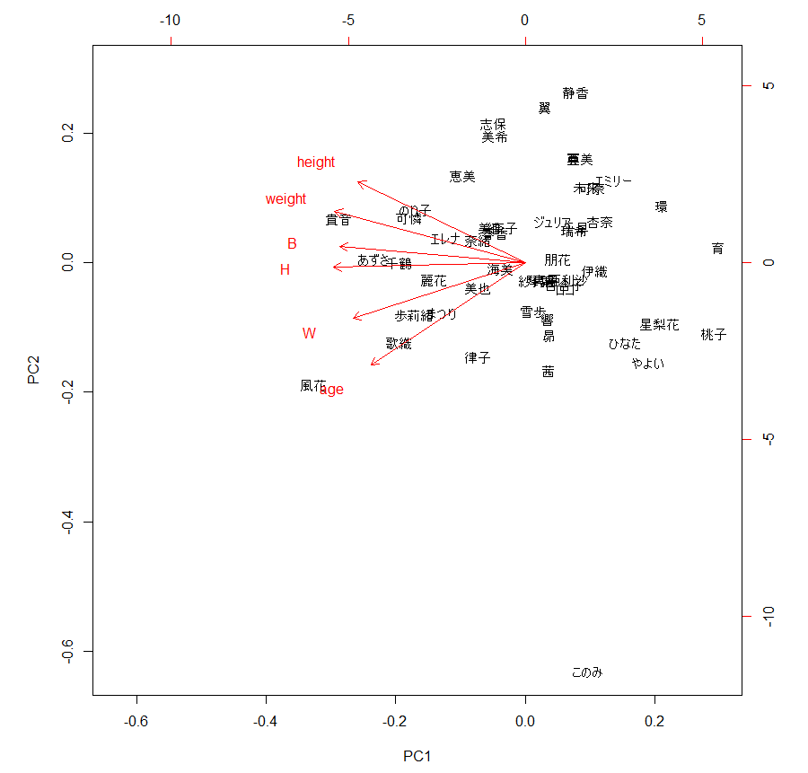
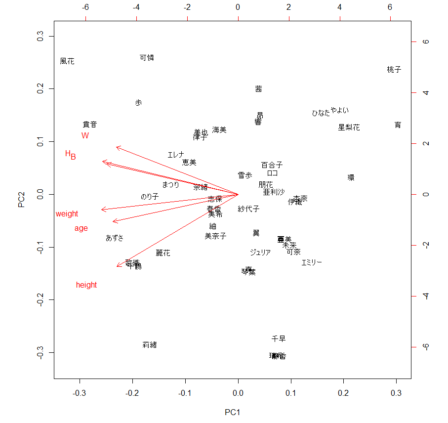
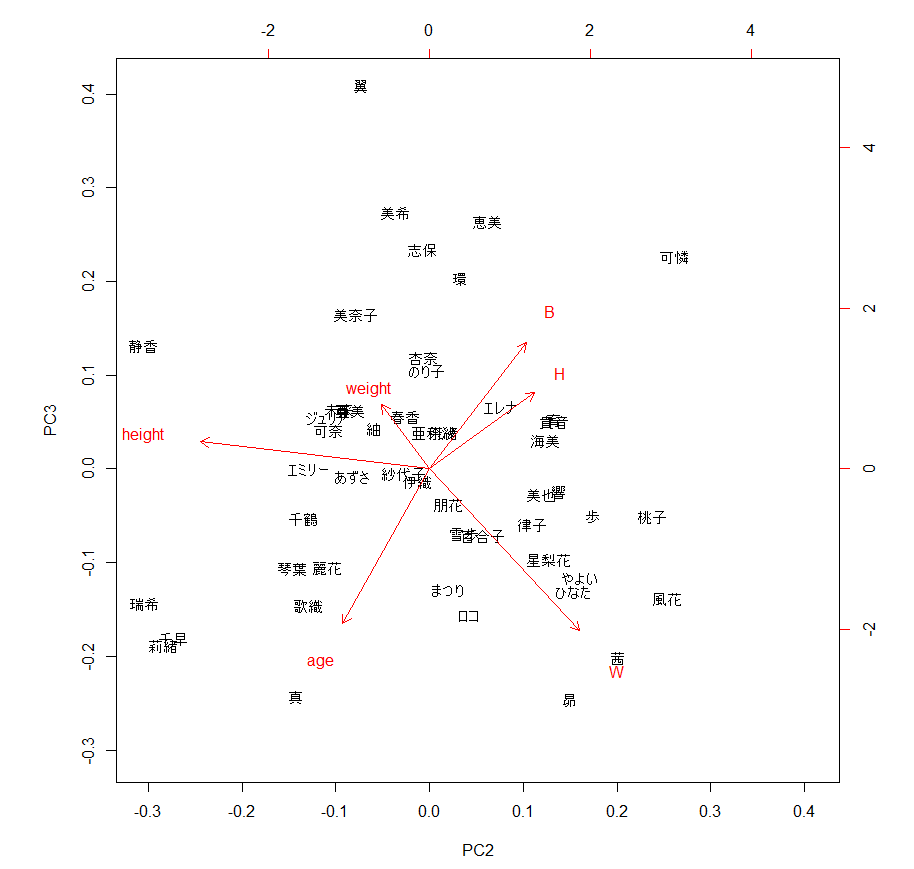

# ミリシタ　特異的な体型のアイドルを見つける、あるいは年少組の将来を予想する

Na2CO3 P

## 要旨

* 千早や風花の体型はフツー
* 可憐、翼、静香の体型は驚異的
* 育は将来貴音のように、桃子は将来風花のようになる

## はじめに

アイドルマスターシリーズはアイドル達のデータがいろいろ公開されているので、つい数字をいじってみたくなります。体型データを主成分分析にかけてアイドルを分類するのはよあるネタであると思われ、導線Pがシンデレラガールズで分析しています[1]。

二番煎じではありますがミリシタでやってみます。せっかくなので分析のやり方も解説してみます。

## 主成分分析の実施

解析には"[R](https://www.r-project.org/)"を使いました。RStudioが便利です。インストールしてください。



まずアイドルの体型データを入手しましょう。例えば[ミリシタ攻略まとめwiki](https://imasml-theater-wiki.gamerch.com/%E3%83%9F%E3%83%AA%E3%82%B7%E3%82%BF%20%E3%82%A2%E3%82%A4%E3%83%89%E3%83%AB%E4%B8%80%E8%A6%A7)に各アイドルの年齢、身長、体重、BWHデータが掲載されています。

このデータを表計算ソフトを使って下のようなcsvファイルを作ります。名前は"idols.csv"とします。

```
name,age,height,weight,B,W,H
春香,17,158,46,83,56,82
エミリー,13,156,41,74,54,76
...
```

RStudioのメニューで、"Session - Set working directory - Choose directory" でcsvファイルを保存したフォルダを指定します。

ではcsvファイルを読み込みます。RStudioの左上の枠に下記コードを入力し、入力したコードを選択して"Ctl-Enter"で実行です。
```R
body <-read.csv("idols.csv", header=T,row.names=1)
```

では主成分分析を実行です。これだけです。
```R
result <- prcomp(body, scale=T)
biplot(result)
```
右下にグラフが表示されました。


中身を見ていきましょう。
```R
round(result$rotation, 3)
```
```
          PC1    PC2    PC3    PC4    PC5    PC6
age    -0.355 -0.676  0.584  0.261 -0.072  0.059
height -0.385  0.532  0.549 -0.222  0.447 -0.136
weight -0.438  0.338  0.039 -0.079 -0.797  0.227
B      -0.427  0.106 -0.367  0.495  0.367  0.540
W      -0.396 -0.367 -0.323 -0.752  0.156  0.123
H      -0.441 -0.030 -0.342  0.258 -0.036 -0.787
```
最も重要な成分がPC1です。PC1は、年齢が0.355単位上がると、身長は0.385単位増加し、体重は0.438単位増加し、BWHもそれぞれ0.427単位、0.396単位、0.441単位増加する、という結果となりました。つまりミリシタのアイドルは年齢が上がると身長・体重・BWHとも成長するってことですね。当たり前といえば当たり前です。

二番目に重要な成分PC2を見てみます。年齢が0.676単位上がると、身長は0.532単位**減少**し、体重は0.338単位**減少**し、Wは0.367単位増加する、という結果です。変ですね。年齢が上がるのに身長が低くなるとは。

グラフを見ても(見なくても)分かりますが、このみさんが異常値を叩き出しているので妙な結果となったようです。

申し訳ありませんが、このみさんは特別枠ということで解析から外すことにいたします。

```R
result2 <- prcomp(body[!(rownames(body) %in% c("このみ")), ], scale=T)
biplot(result2)
```


少しグラフの感じが変わりましたね。

ではあらためて主成分を見てみます。

```R
round(result2$rotation, 3)
```

```
          PC1    PC2    PC3    PC4    PC5    PC6
age    -0.396 -0.268 -0.559 -0.663  0.133 -0.033
height -0.384 -0.706  0.099  0.337 -0.478 -0.044
weight -0.433 -0.149  0.232  0.275  0.795  0.168
B      -0.417  0.297  0.455 -0.344 -0.304  0.566
W      -0.386  0.463 -0.583  0.496 -0.159  0.157
H      -0.430  0.324  0.277 -0.080 -0.059 -0.790
```
* 第一主成分PC1：年齢が高いほど、身長・体重・BWHが大きい→年齢の増加による体格向上
* 第二主成分PC2：年齢が高いほど、身長は高いが、BWHは小さい→痩せ型傾向
* 第三主成分PC3：年齢が高いほど、Wは大きいが、Bは小さい→筋肉質傾向

という感じでしょうか。

第一主成分で分類わけしてもあまり面白くないので、第二と第三成分でグラフを作ります。

```R
biplot(result2,choices=c(2,3))
```


では得られた結果を見ていきましょう。

### 千早、風花は特異的な体型なのか？

千早のB72や風花のB93はよくネタにされますが、どれほど「特異的」なのでしょうか？

グラフを見てみると、千早も風花もそれほど特異的な場所に位置しているわけではありません。平均的とまでは言えませんが、年齢による成長を考慮すれば稀によくある体型であると言えるでしょう。フツーフツー。

### 特異的な体型を持つのは誰か？

グラフで特異的な位置にいるのは、可憐、翼、静香、の3名です。この3名こそが「特異的」と言えます。

まず可憐のデータを見てみます。比較のため他アイドルのデータも載せます。

```R
body[c("可憐", "風花", "貴音"),]
```
```
     age height weight  B  W  H
可憐  16    159     48 90 59 90
風花  22    162     51 93 63 91
貴音  18    169     49 90 62 92
```
16歳という年齢でB90というのはまさに驚異的であると言えます。今後の成長が恐ろしいです。ミリシタアイドルの平均では、1歳年齢が上がるとBは2cm上がるようなので、2年後には風花のサイズを超えてるんじゃないでしょうか…

次に翼です。
```R
body[c("翼", "美希"),]
```
```
     age height weight  B  W  H
翼    14    158     43 85 52 82
美希  15    161     45 86 55 83
```

W細っそ！Bでかっ！これでまだ14歳? いわゆるボン・キュッ・ボンの極地ですかね…

最後に静香。

```R
body[c("静香", "千早", "ジュリア"),]
```
```
         age height weight  B  W  H
静香      14    162     44 76 53 77
千早      16    162     41 72 55 78
ジュリア  16    157     43 79 54 80
```
Wの細さが際立ちます。静香に限らずみんな痩せすぎ。

### 育や桃子は…?

グラフを見ると、育は貴音と同じ場所にいます。桃子は風花の近くに位置しています。育が貴音と同じ「体型」には見えませんが、どういうことなんでしょうか？

今回のグラフは年齢の上昇に伴う体格の向上を示す因子PC1は除外してプロットしました。つまり、年齢による差異はあらかじめ除去(補正)されたプロットとなっています。

とすると、育が順調に成長すれば、将来的には貴音のような体型になるはずです。桃子は風花のような体型になるはずです。

将来が楽しみですね。

## 参考文献

[1] 導線(dousenP), [PCSじゃないよ、PCAだよ](https://www.slideshare.net/maraigue/pcspca), アイマスハッカソン2019 in 名古屋, 2019