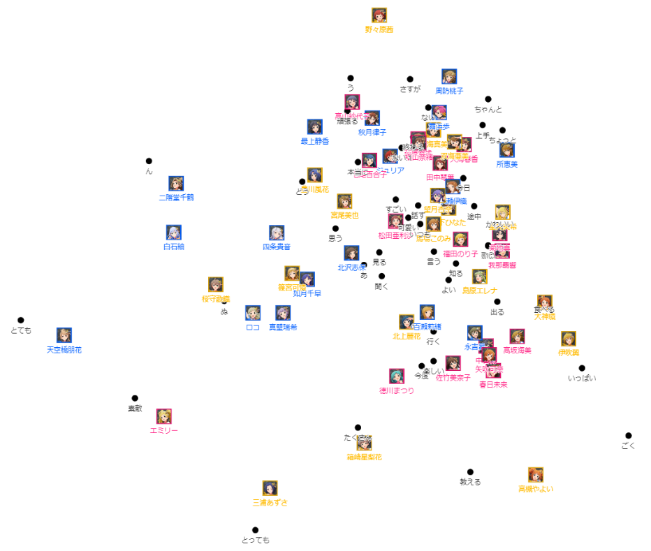
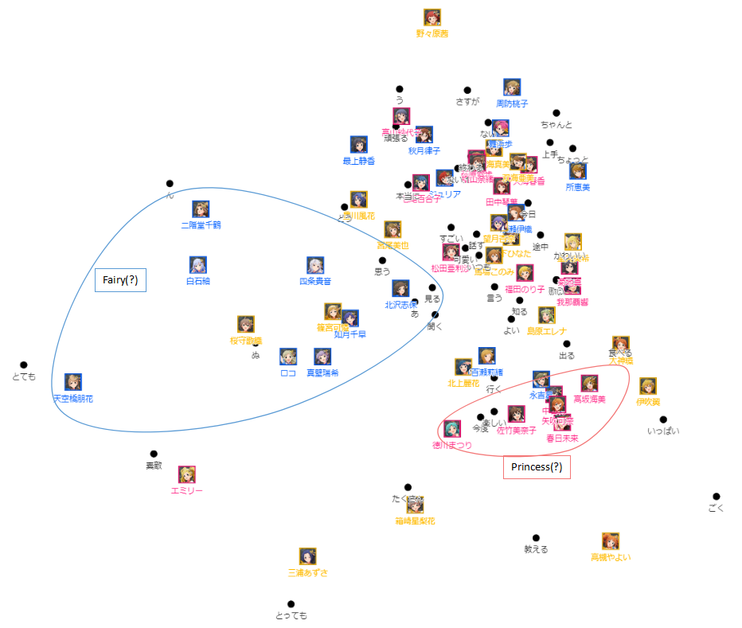
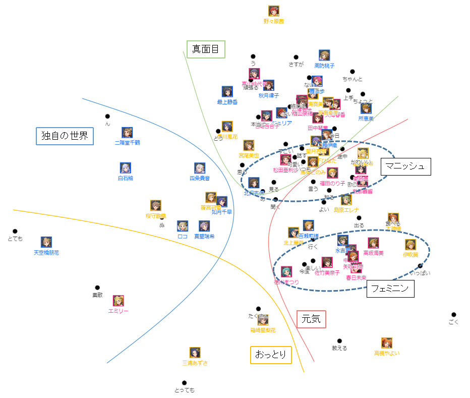

# ミリシタ：オファーテキスト分析によるアイドルのグループ化の試み

Na2CO3 P

## 要旨

* 昴は女子力高いプリンセス属性である。
* Fairyは「クール」, Princessは「楽しい」グループと分類された。Angelは分類不可能。
* 律子さんの真面目さがひしひしと感じられます。

## はじめに

アイドルマスターは15年の歴史をもち、多彩なキャラクターや数多くの楽曲を持つ巨大なコンテンツである。コンテンツを深く理解するために、これらの多様な情報を解析する様々な試みがなされており、テキスト分析に絞っても多くの実施事例がある[1-5]。牧田の例[5]を除けばいずれも楽曲の歌詞を分析対象にしており、ゲームテキストを分析対象にした事例は見受けられなかった。そこで、アイドルマスター ミリオンライブ！ シアターデイズ(以下ミリシタ)の「オファー」で使用されているテキストを対象としてテキスト分析をおこない、各アイドルの特徴を抽出することを試みた。

ちなみに律子さんPです。

## 方法

アイドルごとのオファーテキストをKH Coderで処理し、抽出語を対応分析にかけた。

台詞に含まれる「名詞」は外的要因に影響されると考えられる。今回はアイドルの内面を評価するため「名詞」は解析対象から外した。具体的には以下の品詞を対象として解析を実施した。
   * 形容動詞、ナイ形容、副詞可能、感動詞、動詞、形容詞、副詞、形容詞B、副詞B、否定助動詞、形容詞(非自立)

## 結果および考察

抽出語を対応分析した結果を次図に示す。インタラクティブグラフは[別ページ](../../offer_text_analysis.html)を参照のこと。各アイドルがどのような言葉を使う傾向にあるのか、互いに似た言葉を使うアイドルは誰なのか、などを可視化することができた。

特徴的な言葉遣いの例として、スチュアート「素敵」、天空橋「とても」、三浦「とっても」、箱崎「たくさん」などが近接しており、妥当な表示結果であると判断できる(ただし特徴的な言葉遣いを抽出することが目的の場合は、共起ネットワーク表示が適切である)。

ちなみに律子さんの最近接語は「頑張る」ですが、実際には1回しか使われていませんでした(高山は「頑張る」を5回使用している)。今回分析の対象から外した名詞を見ると「仕事」「番組」という言葉を多用しており仕事の鬼のようです。

対応分析結果の分布から、ミリシタの「属性」(図中ではアイコンの枠で色分けした)による言葉遣いの傾向があるか確認したが、明確な傾向は見られなかった。

属性の一部がグループ化しているブロックを示したものが次の図である。

Fairyのブロックには、Fairy17名のうち二階堂ら8名が含まれている。このブロックにはAngel属性の2名(桜守、篠宮)も含まれており、これら2名は「Fairy的」であるとも言える。なおこのエリアには否定助動詞(「ん」「ぬ」)が見られ、「クール」な言葉遣いをするグループであると言える。

Princessのブロックは、Princess17名のうち徳川ら6名が非常に狭い範囲に入っている。非常に狭いブロックであるにも拘わらず昴が非常に近接していることが興味深い。このエリアには「今度」「楽しい」が位置しており、明るい未来を連想させるグループであると言える。

Angelに関してはブロックを見出すことは困難であった。言葉遣いをもとにしてPrincess-Fairy-Angelの属性を区分することは難しいと考えられる。

ちなみに律子さんは、Fairyのメインブロックからは外れているものの、近くにFairyが何人かいます。サブブロック的な位置づけでしょうか。同じFairyでは最上やジュリアが近くにいますね。Fairyの苦労人グループです。Fairyは自由人と苦労人に分けられるようです。

次に、アイドルの分布をおよその性格の傾向で主観的にグループ化したものが次の図である。おっとり、元気、真面目、独自の世界、の4つの性格傾向に区分することができた。性格の違いが言葉遣いに現れているものと考えられる。今回のグループ分けでは、ジュリア、舞浜、野々原が「真面目」グループに入ることになったが、実際その通りではないかと思われる。ただし亜美、真美が「真面目」グループに入ったのは、テキスト分析の限界を示しているものと思われる。

またさらに細かく見ると、菊地や福田を中心とした「男性性(マニッシュ)」、佐竹や伊吹を中心とした「女性性(フェミニン)」のブロックを見出すことも可能であろう。両者は近接しており、男性性と女性性は表裏一体であることが示唆される。なお昴が「女性性」のブロックに位置していることは特記すべきである。

ちなみに律子さんは真面目グループのど真ん中って感じですね。高山、最上と合わせて真面目サミットの形成です。最上もメガネかけちゃいましょう。

## まとめ

ミリシタのオファーテキストを分析することにより、アイドルの特徴をグループ化することを試みたが、必ずしも明確なグループ化はできなかった。あえて言えば、クールで独自の世界観を持つFairy属性と、楽しい女性的なPrincess属性を一部のメンバーに見出すことができた。ゲームをプレイした実感を、テキスト分析により裏付けることができたと言える。

今回のオファーテキスト分析では、発話者がどのような言葉遣いであるのかを分析した。一方でオファーテキストでは発言の受け手が明確になっていることから、受け手を分析の中心にすることも可能である。その場合、アイドルが周囲からどのように評価されているのかを示すことができる。発話内容のテキスト分析と、受話内容のテキスト分析を合わせることで、多面的な評価が可能になると考えられる。

ちなみに律子さんの周囲に「真面目」グループがうまいこと形成されたのはかなり意外でした。律子さんの真面目さが証明されたとも言えますし、テキスト分析の力が発揮されたとも言えます。あなたの担当アイドルはどうだったでしょうか？

## 謝辞
* アイドルマスター ミリオンライブ！ シアターデイズ(ミリシタ)はバンダイナムコエンターテインメント社が所有するコンテンツです。画像やテキストの著作権は同社が保有しています。
* 解析に使用したKH Coderは樋口耕一氏が開発したソフトウェアです。

## 参考文献
[1] 紅木弘, [歌詞から「○○らしさ」は見いだせるのか？～天海春香，如月千早～](https://idolmaster-statistics.hatenablog.com/entry/2020/01/14/010000), 2020, アイマス統計

[2] Natsco, [【アイドル研究/歌詞編①】二次元アイドルは「夢」を歌う。](http://iam-natsco.hateblo.jp/archive/2017/05/13), 2017, I am Natsco

[3] 本郷 萌香, [作詞家 森由里子の歌詞における表現特性](http://www.osaka-kyoiku.ac.jp/~kokugo/nonami/2019soturon/hongou.pdf), 2019, 大阪教育大学卒業論文

[4] kasumi, [プリキュアは16年間、何を歌ってきたのか　413曲の分析から見えたもの](https://nlab.itmedia.co.jp/nl/articles/2005/28/news024.html), 2020, ねとらぼ

[5] 牧田翠, アイマスP統計, 2019, でいひま統計シリーズ
